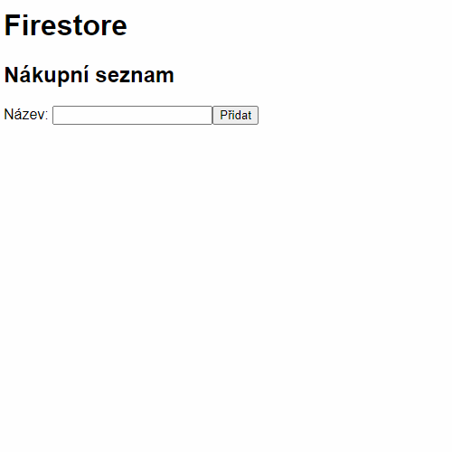

# Cvičení: Firestore nákupní seznam

## Úvod

Firestore je online databáze z balíčku služeb [Firebase](https://firebase.google.com/) od Googlu, kterou volně můžete zapojit do vašich projektů. Vaši uživatelé pak budou mít přístup k těm nejčerstvějším datům podobně jako když stahují pomocí `fetch`. Zároveň jim můžete dovolit i data zapisovat a sdílet mezi sebou.

V následujícím cvičení si vyzkoušíte vytvořit malou aplikaci pro nákupní seznam.

Dokumentace Firestore: https://firebase.google.com/docs/firestore



## Zadání

1. Založ nový projekt pomocí [create-czechitas-app](https://www.npmjs.com/package/create-czechitas-app).

1. Ve Firebase konzoli (https://console.firebase.google.com/) přidej nový projekt. Pojmenuj ho například `Nakupni seznam`. Stiskni tlačítko `Continue`.

1. V kroku `Google Analytics for your Firebase project` zruš zapnuté Analytics. Nejsou důležité a komplikují vytvoření první aplikace.

1. V projektu přejdi v levém menu do záložky `Firestore`.

   1. Stiskni tlačítko `Create database`.
   1. Zaškrtni `Start in test mode`.
   1. V dalším kroku pro polohu zvol `eur3 (europe-west)`.

1. Vytvoř kolekci pomocí `Start collection` s názvem `seznam`.

   1. V ní vytvoř první dokument s `Auto-ID` a s fieldem `nazev`=`První položka`.
   1. Přidej druhý dokument s názvem `Druhá položka`.

1. V `Project overview` přidej Web app.

   1. Pojmenuj ji `Nakupní seznam`.
   1. Nezaškrtávej `Firebase Hosting`. Pro hostování jsme si ukazovali Netlify ([video](https://www.youtube.com/watch?v=sAcJKh6n5DA&list=PLTCx5oiCrIJ5t0LiyDOpBDTgcs-d99UwD&index=30)). Není potřeba se učit nový hosting.
   1. Register app.
   1. Nech si stránku otevřenou.

1. V terminálu ve složce s projektem z kroku 1 nainstaluj Firebase SDK pomocí `npm install firebase`.
1. Ve složce `src` vytvoř soubor `db.js`.

   1. Naimportuj v něm `firebase`.
      ```js
      import firebase from 'firebase/app'
      import 'firebase/firestore'
      ```
   1. Zkopíruj do něj proměnnou `firebaseConfig` a `firebase.initializeApp(firebaseConfig)` z konzole v prohlížeči.
   1. Exportuj konstantu pro přístup k databázi `export const db = firebase.firestore()`

1. Založ komponentu `NakupniSeznam`.
1. Vlož komponentu do stránky.
1. Přidej komponentě stav s polem objektů.

   ```js
   const [polozky, setPolozky] = useState([
   	{
   		nazev: 'První hardcodovaná položka',
   	},
   	{
   		nazev: 'Druhá hardcodovaná položka',
   	},
   ])
   ```

1. Vypiš položky do odrážkového seznamu.

   ```
   <ul>
   	{polozky.map((polozka, i) => (
   		<li key={i}>{polozka.nazev}</li>
   	))}
   </ul>
   ```

1. Zkontroluj v prohlížeči. Měl by se na stránce ukázat seznam o dvou položkách.
1. Hardcodované položky nahraď za položky z db.

   1. Naimportuj do komponenty soubor `db.js`.
   1. Přidej `useEffect`, který se vykoná jen při prvním renderu.

      ```js
      useEffect(() => {}, [])
      ```

   1. V efektu poslouchej na změny v kolekci `seznam`.

      ```js
      db.collection('seznam').onSnapshot((querySnapshot) => {})
      ```

   1. Při přijetí změn (`onSnapshot`) aktualizuj stav `polozky`.

      ```js
      setPolozky(querySnapshot.docs.map((doc) => doc.data()))
      ```

   1. Nastav počáteční stav na prázdné pole. Smaž hardcodované objekty.

1. Zkus ve Firebase konzoli přidat do seznamu novou položku. Měla by se ihned objevit i na tvé stránce.

1. `useEffect` by si po sobě měl i uklidit pro případ, že se komponenta odpojí ze stránky.

   1. `db.collection('seznam').onSnapshot` vrací funkci pro vypnutí poslouchání změn. Pokud ji v `useEffect` vrátíme, React ji ve správný čas spustí a vypne tím posluchač. Přidej před zmíněný kód `return`.

1. Vytvoř formulář na přidávání položek.

   1. Přidej stav pro textové políčko `const [nazev, setNazev] = useState('')`.
   1. Přidej formulář.

      ```
      <form>
      	<label>
      		Název:{' '}
      		<input
      			value={nazev}
      			onChange={(event) => setNazev(event.target.value)}
      		/>
      	</label>
      	<button>Přidat</button>
      </form>
      ```

   1. V události `onSubmit` zamez přenačtení stránky pomocí `event.preventDefault()` při uložení.
   1. V události přidej nový dokument do kolekce.

      ```jsx
      db.collection('seznam').add({ nazev })
      ```

   1. Vymaž text v textovém políčku.

      ```jsx
      setNazev('')
      ```

1. Seřaď položky podle data přidání.

   1. Při přidávání položky do seznamu ulož i aktuální datum.

      ```js
      db.collection('seznam').add({
      	nazev,
      	datumVytvoreni: firebase.firestore.FieldValue.serverTimestamp(),
      })
      ```

   1. Nezapomeň na `import firebase from 'firebase/app'`.
   1. Přidej `.orderBy('datumVytvoreni')` do dotazu na položky.

      ```js
      useEffect(() => {
      	return db
      		.collection('seznam')
      		.orderBy('datumVytvoreni')
      		.onSnapshot((querySnapshot) => {
      			setPolozky(querySnapshot.docs.map((doc) => doc.data()))
      		})
      }, [])
      ```

   1. Z výpisu ti zmizí staré položky, které datum nemají. Klidně je smaž ve Firebase konzoli.

1. Přidej uživateli možnost označovat položky jako koupené.

   1. Při přidávání položky do seznamu jí nastav `koupeno: false`.
   1. V mapě pro výpis položek přidej checkbox.

      ```
      <input
      	type="checkbox"
      	checked={polozka.koupeno}
      	onChange={(event) => {}}
      />
      ```

   1. Při stahování položek si ulož do stavu `id` každé položky.

      ```js
      setPolozky(
      	querySnapshot.docs.map((doc) => {
      		const data = doc.data()
      		data.id = doc.id
      		return data
      	}),
      )
      ```

   1. Po kliku na checkbox uprav `koupeno` v databázi.

      ```js
      db.collection('seznam').doc(polozka.id).update({
      	koupeno: event.target.checked,
      })
      ```

   1. Devtools konzole ti u starých položek, které nemají vlastnost `koupeno`, bude hlásit chybu. Můžeš je pomocí Firebase konzole smazat.

1. Přidej možnost položky mazat.

   1. Za název položky přidej tlačítko `<button>smazat</button>`.
   1. Po kliku odeber položku z databáze.

      ```js
      db.collection('seznam').doc(polozka.id).delete()
      ```

## Bonus

1. Zapoj do projektu [React Router](https://reactrouter.com/web/guides/quick-start).

   1. Na úvodní cestě měj výpis všech položek v seznamu a na druhé detail položky.

   1. Přidej switch podle ukázky. Vytvoř chybějící komponentu `Detail`, která pro zatím může vykreslovat jen nadpis `<h1>Detail</h1>`.

   ```
   <Switch>
   	<Route path="/detail/:id">
   		<Detail />
   	</Route>
   	<Route path="/">
   		<NakupniSeznam />
   	</Route>
   </Switch>
   ```

   1. Ve výpisu položek udělej ze všech názvů odkazy pomocí `<Link>`.

   ```
   <Link to={`/detail/${polozka.id}`}>{polozka.nazev}</Link>
   ```

   1. Nezapomeň naimportovat `Link`.

   ```js
   import { Link } from 'react-router-dom'
   ```

1. Do `Detail` přidej odkaz zpět na výpis.

   ```
   <Link to="/">Přejí na výpis</Link>
   ```

1. Přidej do detailu výpis `id`.

   ```jsx
   const { id } = useParams()
   ```

   ```jsx
   <p>Id: {id}</p>
   ```

1. Vyzkoušej si proklikat několik položek v seznamu. Sleduj, že `id` na stránce detailu se mění.

1. Přidej do detailu stav pro data položky.

   ```js
   const [polozka, setPolozka] = useState(null)
   ```

1. Pomocí `useEffect` stáhni do stavu data.

   ```js
   useEffect(() => {
   	return db
   		.collection('seznam')
   		.doc(id)
   		.onSnapshot((doc) => {
   			setPolozka(doc.data())
   		})
   }, [id])
   ```

1. Data si cvičně můžeš v detailu vypsat třeba pomocí `<pre>{JSON.stringify(polozka, null, 2)}</pre>`.

1. Všimni si, že data jsou před načtením na chvilku nastaveny na `null`. To protože stahování chvilku trvá.

1. Pokud se data načítají, vypiš text `Načítám`. V opačném případě do nadpisu napiš `{polozka.nazev}`.

1. Vypiš datum vytvoření položky.
   ```
   <div>
   	Datum vytvoření: {polozka.datumVytvoreni.toDate().toLocaleString()}
   </div>
   ```
