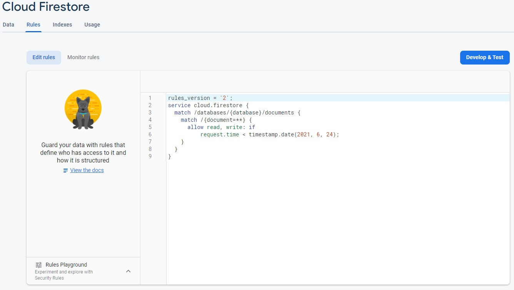
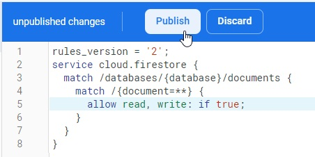

# Firestore: zabezpečení dat

Dokumentace pro [Firebase Security Rules](https://firebase.google.com/docs/firestore/security/get-started).

Na základě zadání [úkolu](README.md) máš založenou databázi v testovací režimu. Vychozí nastavení pro experimenty je na jeden měsíc, po kterém se databáze sama uzamkne. Všechna data, i od uživatelů, budou stále k dispozici ve [Firebase konzoli](https://console.firebase.google.com/), ale nepůjde je číst ani do nich zapisovat ve frontendové aplikaci v JavaScriptu na tvém webu. Pár dní před uzamčením ti přijde od Googlu e-mail.

Před tebou stojí rozhodnutí, co dál. Máš tři možnosti.

## 1. Strčit hlavu do písku

Nejjednodušší postup. Nedělat nic. S vypršením přístupu se ti na frontendu přestanou zobrazovat aktuální data. Nepůjdou ani přidávat. Konzole ve vývojářských nástrojích ti bude zobrazovat chybu ohledně práv.

Přístup s hlavou v písku může dávat smysl například u testovacích projektů, kdy si chceš jen něco rychle vyzkoušet a není potřeba, aby web fungoval i po měsíci.

Pokud s projektem nemáš už žádné další plány, můžeš ho případně úplně smazat a uvolnit tím místo pro další. Celkový počet projektů je omezený na pár desítek. Není ale nutné spěchat. Smazat ho můžeš klidně až ti bude chybět místo.

Pro smazání jdi do `Project settings` a úplně dole na stránce klikni na `Delete project`. Postupuj podle pokynů v bublině, která se objeví.

## 2. Nechat databázi úplně otevřenou

Druhý nejjednodušší postup. Vyžaduje změnu dvou řádků v sekci `Rules`.

1. Proklikni modré tlačítko `Edit rules` z e-mailu nebo přejdi přes `Firestore Database` do `Rules` ve Firebase konzoli. Dostaneš se na stránku, která vypadá přibližně takto:

   

1. Všimni si pátého a šestého řádku. Ty říkají, že povoleno číst a zapisovat (`allow read, write`) platí, jestliže (`if`) je čas požadavku (`request.time`) starší než 24. 6. 2021 (`timestamp.date(2021, 6, 24)`). Všechny požadavky z frontendu tedy do tohoto data můžou číst a zapisovat. Zápisem se myslí přidávání (`add`) i úpravy (`update`) a mazání (`delete`).

1. Pro odemčení databáze na věky věků změň výše zmíněné dva řádky na `allow read, write: if true;`. Jinými slovy vše je povoleno, pokud je `true` pravda, což je vždycky.

1. Změnu zveřejni tlačítkem `Publish`.

   

Úplné odemčení se hodí, pokud v databázi nemáš žádná hodnotná nebo citlivá, tajná data uživatelů a pokud zároveň tvůj web není lákavým terčem hackerů, internetových záškodníků spammerů.

Zkušenější programátor zvládne z tvého webu ze zdrojových kódů JavaScriptu vytáhnout přístupové údaje do databáze. Z ní pak může cokoliv číst nebo data měnit nehledě na to, jestli to umí tvůj web.

Jestli je třeba tvůj web hra, pro kterou ukládáš do databáze tabulku vítězů, záškodník by mohl do tabulky přidat falešné skóre, aby se umístil na první místo. U malých her většinou nikdo nemá motivaci podvádět, dávat si tu práci se do databáze nabourávat a tím pádem příliš nevadí, když zůstane nezabezpečená. Když na to přijde a tvému webu se začne hodně dařit, dokonce tak, že kromě běžných návštěvníků přiláká i nějaké hackery, můžeš podle třetího bodu zabezpečení doplnit dodatečně.

Jestli tvůj web pomocí databáze umožňuje třeba mezi uživateli posílat soukromé zprávy, zabezpečení určitě zvaž. Hacker je jinak totiž schopný číst i zprávy, které nejsou určené jemu nebo dokonce rozesílat zprávy pod cizím jménem. Podobným útokům čelí i velikáni jako Facebook Messenger nebo WhatsApp.

## 3. Nastudovat způsoby zabezpečení a přístup do databáze částečně omezit

Poslední varianta je nejsložitější. Většinou se používá v kombinaci s dalšími službami jako je Firebase Authentication, Firebase Functions nebo s plnohodnotným backendem.

V principu jde o to, že se omezí přístup k databázi na základě složitějších podmínek. Například, že data můžou zapisovat a číst jen přihlášení uživatelé nebo že mají přístup jen k nějaké části dat.

Ukázky různých omezení jsou popsány v [dokumentaci](https://firebase.google.com/docs/firestore/security/rules-conditions).
