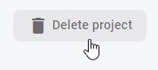

# Firestore: zabezpečení dat

Dokumentace pro [Firebase Security Rules](https://firebase.google.com/docs/firestore/security/get-started).

Na základě zadání [úkolu](README.md) máš založenou databázi v testovací režimu. Vychozí nastavení pro experimenty je na jeden měsíc, po kterém se databáze sama uzamkne. Všechna data, i od uživatelů, budou stále k dispozici ve [Firebase konzoli](https://console.firebase.google.com/), ale nepůjde z nich číst ani do nich zapisovat ve frontendové aplikaci, v JavaScriptu na tvém webu. Pár dní před uzamčením ti přijde od Googlu e-mail.

Před tebou stojí rozhodnutí, co dál. Máš tři hlavní možnosti.

## 1. Strčit hlavu do písku

Nejjednodušší postup. Nedělat nic. S vypršením přístupu se ti na frontendu přestanou zobrazovat aktuální data. Nepůjdou ani přidávat. Konzole ve vývojářských nástrojích ti bude zobrazovat chybu ohledně práv.

Přístup s hlavou v písku může dávat smysl například u testovacích projektů, kdy si chceš jen něco rychle vyzkoušet a není potřeba, aby web fungoval i po měsíci.

Pokud s projektem nemáš už žádné další plány, můžeš ho případně úplně smazat a uvolnit si tím místo pro další. Celkový počet projektů je omezený na pár desítek. Není ale nutné spěchat. Smazat ho můžeš klidně až ti bude chybět místo.

Pro smazání jdi do `Project settings` a úplně dole na stránce klikni na `Delete project`. Postupuj podle pokynů v bublině, která se objeví.

## 2. Nechat databázi úplně otevřenou

## 3. Nastudovat způsoby zabezpečení a přístup do databáze částečně omezit
